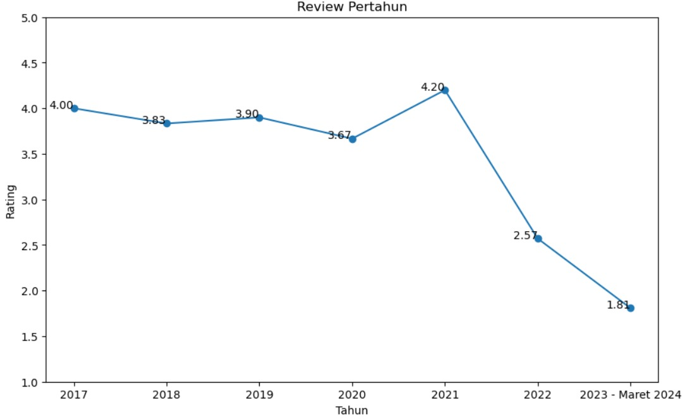

# Analisis-Sentimen-Rendahnya-Rating-Alfamart
Proyek ini merupakan bagian dari mata kuliah Kecerdasan Bisnis yang bertujuan untuk menerapkan analisis data dalam menyelesaikan permasalahan nyata di lingkungan sekitar. Dalam kasus ini, fokus utama adalah mengidentifikasi penyebab rendahnya rating pada salah satu gerai Alfamart di Google Maps melalui analisis sentimen terhadap ulasan pelanggan.

## Dataset
Dataset dalam proyek ini dikumpulkan secara manual dari Google Maps. Terdapat empat elemen utama yang diambil dari setiap ulasan pengguna, yaitu:
1. Nama pengguna yang memberikan review,
2. Komentar atau isi ulasan yang dituliskan,
3. Jumlah bintang atau rating yang diberikan,
4. Waktu atau tanggal saat review tersebut diposting.

## Metode yang digunakan
1. Berbasis Leksikon
   - Inti dari metode ini adalah penggunaan kamus atau leksikon (kamus_positif dan kamus_negatif). Kamusnya dibuat berdasarkan kata-kata yang muncul pada saat review       Setiap kata di dalam kamus ini sudah memiliki skor sentimen yang ditentukan sebelumnya (misalnya, 'ramah' bernilai 1, 'buruk' bernilai -1). Jadi sentimen    positif, negatif dan netral tergantung skor yang didapat pada perhitungan akhir. jika 0= netral, jika 0> maka negatif dan jika 0< maka positif. 
2. Berbasis Aturan
   - Karena banyak dalam penggunaan review menggunakan kata "tidak", pada review ("tidak ramah") maka jika ada kata tidak kata positif itu akan menjadi negatif.

## Hasil
### Penurunan Rating

Berdasarkan grafik diatas penurunan rating yang sangat signifikan terjadi pada tahun 2021 ke 2022 dan berlanjut hingga maret 2024
### Penyebab Penurunan Rating
ada 3 hal yang paling sering muncul di kolom review yaitu kasir, layan dan harga.
berdasarkan analisis sentimen berikut fakta yang di dapat : 
1. Kasir mendapatkan setimen
   - netral: 19.05%
   - negatif: 71.43%
   - positif: 9.52%
2. Layan mendapatkan setimen
   - netral: 31.25%
   - negatif: 43.75%
   - positif: 25.00%
3. Harga mendapatkan setimen
   - netral: 22.22%
   - negatif: 33.33%
   - positif: 44.44%
Berdasarkan hasil diatas kasir memiliki sentimen negatif tertinggi yang menjadi salah satu penyebab rendahnya rating di alfamart paingan
